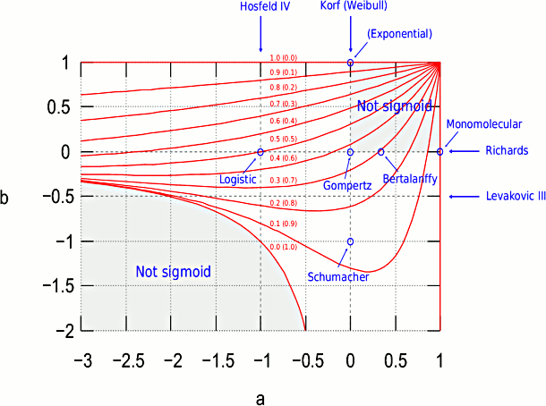

# resde  -  Estimation in Reducible Stochastic Differential Equations

An R package for maximum likelihood parameter estimation in reducible stochastic differential equation models.
Discrete, possibly noisy observations, not necessarily evenly
spaced in time.
Can fit multiple individuals/units with global and local
parameters, by fixed-effects or mixed-effects methods.

This is a beta version, with limited testing so far. Use with care.



### Installation

One way is to use
`remotes::install_github("ogarciav/resde")`
or
`devtools::install_github("ogarciav/resde")`


### Demo

Fit the Richards model  dH^c = b(a^c - H^c) dt + s dW
to the heights of the first tree in `Loblolly`. Assume H(0) = 0, and no
observation error.

```r
library(resde)
tree <- subset(Loblolly, Seed == Seed[1])
m <- sdemodel(~x^c, beta0=~b*a^c, beta1=~-b, mum=0)
sdefit(m, x="height", t="age", data=tree, start=c(a=70, b=0.1, c=0.5))
```

### Vignette

[Fitting Reducible SDE Models](https://www.researchgate.net/publication/344293978)

### References

García, O. (2019). "Estimating reducible stochastic differential equations by
conversion to a least-squares problem". *Computational Statistics 34*: 23-46. [doi: 10.1007/s00180-018-0837-4](https://doi.org/10.1007/s00180-018-0837-4)
